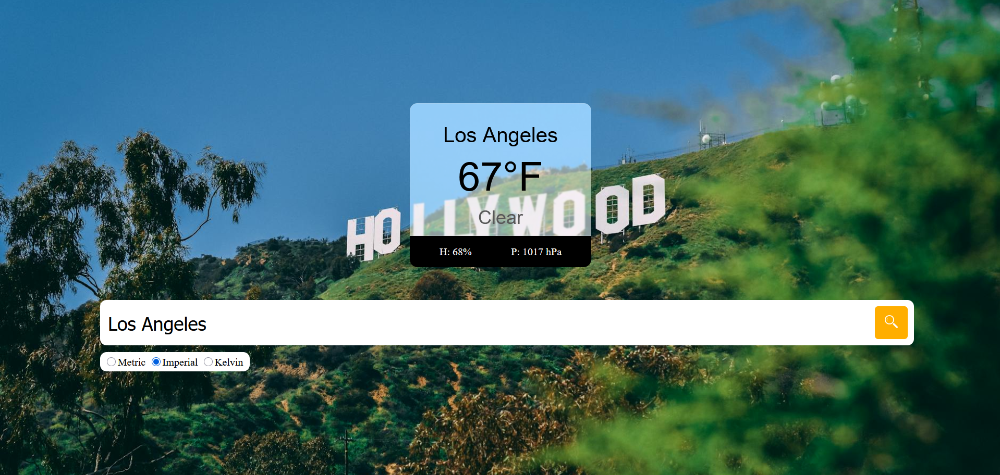
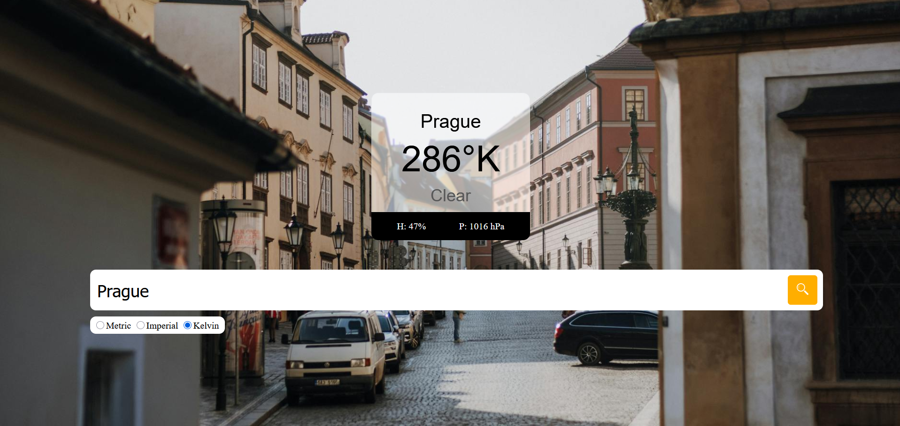
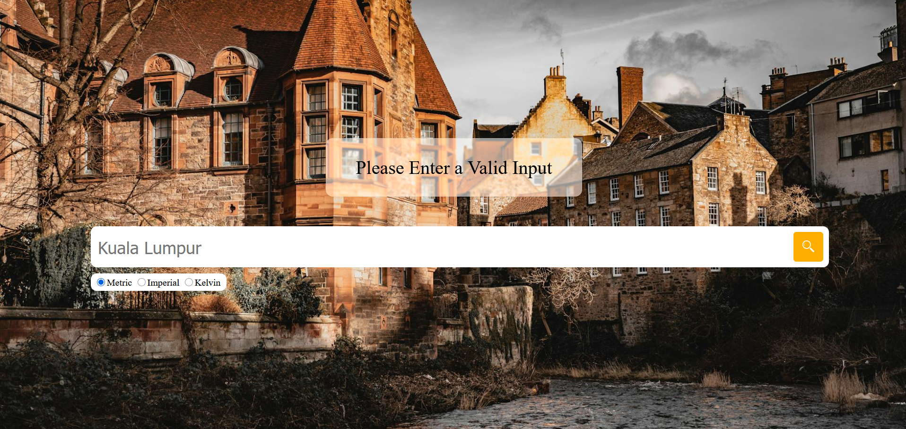
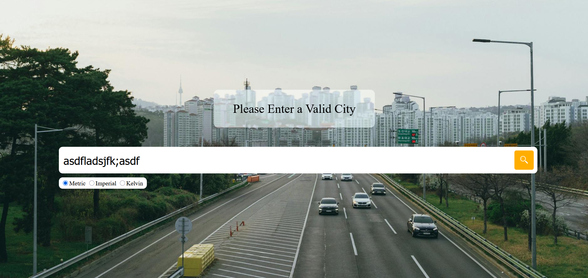

# weather-app
## Weather App using OpenWeather & Pexels API
Weather App made using basic HTML-CSS-Javascript, utilizing the free tier API's of OpenWeather for geo-weather data and Pexels for background image.

1. Search the weather from OpenWeather API
2. Dynamically changing background using Pexels API
3. Multiple unit of measurement

## How it works
- User input is processed to find the latitude and longitude of the city using OpenWeather's Geocoding API
- The extracted latitude and longitude is used to find the city's data using OpenWeather's '5 Day forecast' data
- The user input is also used to find a suitable background image using Pexel's API

## Screenshots
### Default Interface

### Imperial Interface

### Kelvin Interface

### Empty Interface

### Error Interface

## How to run
1. Download the project
2. Replace the placeholder with real API keys (OpenWeather's API must use the '5 day weather forecast' type)
3. run index.html